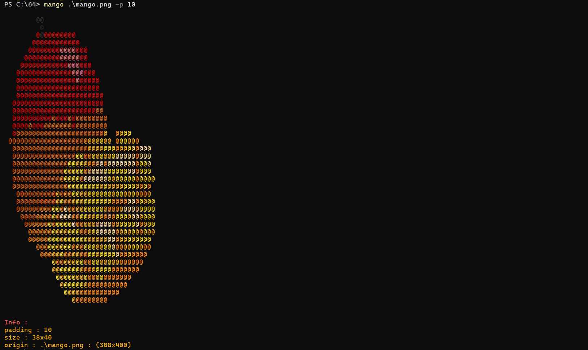

# Mango

Mango is a command-line tool that converts images into ASCII art and displays them in the terminal with color support.



## Features

- Supports multiple image formats (PNG, JPEG, BMP, JPG, JFIF, GIF)
- Customizable padding for output
- Colored output using terminal escape sequences
- Simple and intuitive command-line interface

## Requirements

- Terminal with color support
- C compiler (GCC or Clang recommended)

## Setup

Before building the project, you need to download the `stb_image.h` header file:

1. Create a `src/stb` directory in the project root if it doesn't exist:
   ```
   mkdir -p src/stb
   ```

2. Download `stb_image.h` into the `src/stb` directory:
   ```
   curl -o src/stb/stb_image.h https://raw.githubusercontent.com/nothings/stb/master/stb_image.h
   ```

   Or if you're using Windows without curl, you can manually download the file from the URL and place it in the `src/stb` directory.

## Usage

After building the project, you can run Mango with the following syntax:

```
./mango [options] <file-path>
```

### Options

- `-p, --pad <value>`: Set padding (default: 3)
- `-h, --help`: Display help message

### Example

To convert an image named "example.png" with a padding of 2:

```
./mango -p 2 example.png
```

## License

This project is licensed under the MIT License - see the [LICENSE](LICENSE) file for details.

## Acknowledgments

- [stb_image](https://github.com/nothings/stb) library for image loading
- Inspired by various terminal-based image viewers