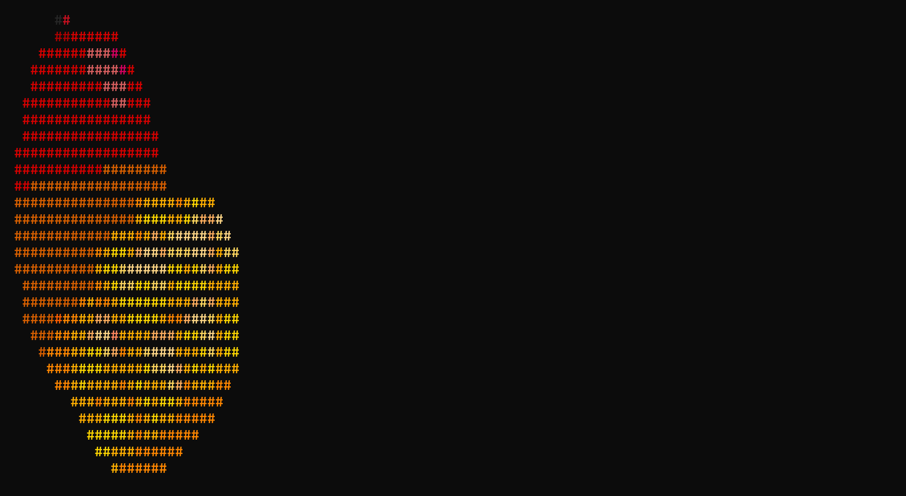

# Mango

Mango is a command-line tool that converts images into ASCII art and displays them in the terminal with color support.



## Features

- Supports multiple image formats (PNG, JPEG, BMP, JPG, JFIF, GIF)
- Customizable padding for output
- Adjustable maximum width for resizing large images
- Colored output using terminal escape sequences
- Simple and intuitive command-line interface

## Requirements

- Terminal with color support
- C compiler (GCC or Clang recommended)
- Git

## Setup

Before building the project, you need to clone the `stb` repository to get the required header files:

1. Open a terminal and navigate to the project root directory.

2. Run the following command to clone the `stb` repository into the `src/stb` directory:
   ```
   git clone https://github.com/nothings/stb src/stb
   ```

   This will create a `src/stb` directory containing all the necessary header files, including `stb_image.h` and `stb_image_resize2.h`.

## Usage

After building the project, you can run Mango with the following syntax:

```
./mango [options] <file-path>
```

### Options

- `-p, --pad <value>`: Set padding (default: 1)
- `-w, --width <value>`: Set maximum width (default: console width)
- `-h, --help`: Display help message

## License

This project is licensed under the MIT License - see the [LICENSE](LICENSE) file for details.

## Acknowledgments

- [stb](https://github.com/nothings/stb) library for image loading and resizing
- Inspired by various terminal-based image viewers